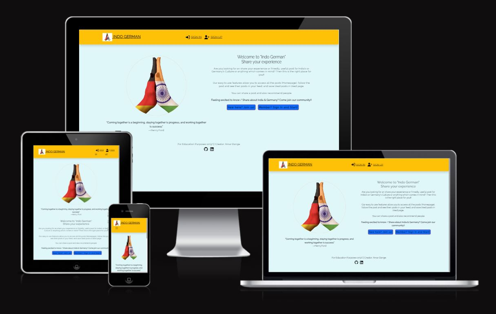

# Welcome to **[ Indo German (PP5)](https://indo-german-pp5-e488026ec98b.herokuapp.com/)**

## PERSPECTIVE
The main reason behind this App is to help or provide information about immigrants in Germnay or India
The main motive is to provide information about eduation, Places to visist, food, Visa. The attempt of the project is to create a social media App to connect like minded people who wish to help people who are coming to germany or india. Some bais points are shared on this App where people get basic idea from Countrues of India and germany.

 ## Deployed Link

- [Front-End Deployed Link](https://indo-german-pp5-e488026ec98b.herokuapp.com/)

## Back End Links

- [Back End Deployed Link](https://indo-german-932e214b60bd.herokuapp.com/)
- [Back End GitHub](https://indo-german-932e214b60bd.herokuapp.com/)

## Table of Contents

- [Indo German - Front-End](#indo-german---front-end)
  * [Deployed Link](#deployed-link)
  * [Back End Links](#back-end-links)
  * [User Experience (UX)](#user-experience--ux-)
    + [User Stories](#user-stories)
    + [Site Goals](#site-goals)
    + [Kanban Board and MosCow Prioritization](#kanban-board-and-moscow-prioritization)
    + [Design](#design)
    + [Wireframes](#wireframes)
  * [Features](#features)
    + [Existing Features](#existing-features)
    + [Future Features](#future-features)
  * [Technologies Used](#technologies-used)
    + [Languages and Packages/Libraries Used](#languages-and-packages-libraries-used)
    + [Programs Used](#programs-used)
  * [Testing](#testing)
    + [Validation Testing](#validation-testing)
    + [Manual Testing](#manual-testing)
    + [Bugs](#bugs)
  * [Deployment](#deployment)
  * [Credits](#credits)
    + [Code](#code)
    + [Acknowledgements](#acknowledgements)

## User Experience (UX)

### User Stories

- Users: 

    - Authentication

    1. As a **user** I can **easily log in** so that **I can quickly post, add more comments, or delete content if I wish.**

    2. As a **user** I can **easily log out** so that **I can have more security on my account.**

    3. As a **user** I can **sign up easily with just a username and password** so that **I have the ability to create posts or comments without having to share my email address.**

    4. As a **user** I **cannot edit/delete posts/comments/likes that are not mine** so that **I can be assured that my posts/comments/likes are protected and can only be changed by me.**

    5. As a **user** I can **only like/unlike other users' posts and comments** so that **I can only show my appreciation for other posts/comments and not cheat the system by liking my own posts/comments.**

    6. As a **user** I can **only follow other users** so that **I cannot cheat the system and follow myself and gain myself a new, false follower.**

    7. As a **user** I can **see whether I am logged in or not** so that **I will know if I will need to log in if I am not.**

    8. As a **user** I can **maintain my logged-in status** so that **I will not need to constantly log in when not on the website for a few hours, and can log out manually whenever I want to log out.**

    - Posts

    1. As a **user** I can **create new posts** so that **I can share images, my thoughts, or what I'm doing.**

    2. As a **user** I can **edit posts** so that **I can change my posts, images, etc whenever I change my mind about what I posted or wish to remove/add details.**

    3. As a **user** I can **delete my posts** so that **I can get rid of my posts that I no longer want to be shared.**

    4. As a **user** I can **view the details of a post** so that **I can read more information about the post such as when it was created, who created it, if it was edited, read the comments, etc.**

    5. As a **user** I can **like posts** so that **I can share my appreciation for the post and show the world and the author that their post is great.**

    6. As a **user** I can **remove likes on a post** so that **I can change my mind about whether I like the post or not.**

    - Comments

    1. As a **user** I can **post a comment on a post** so that **I can contribute discussion to a post or share my thoughts about a post.**

    2. As a **user** I can **delete my comments on a post** so that **I can remove comments if I no longer want my comments to be public.**

    3. As a **user** I can **read comments on a post** so that **I can read what others think about the post and read the discussion happening.**

    4. As a **user** I can **edit my comments** so that **have the possibility to remove or add more details to my existing comments.**

    5. As a **user** I can **like comments** so that **I can share my appreciation for the comment.**

    6. As a **user** I can **unlike comments** so that **I can change my mind about my positive feelings towards a comment.**

    - Navigation

    1. As a **user** I can **a nice 500 page consistent with the site layout** so that **I can be communicated with if there are issues with the website's server or backend.**

    2. As a **user** I can **have the navigation bar customed to my logged-in or out status** so that **I can have the options to log in or sign up when logged out, or have the options to create a post, view my profile, sign out, etc when logged in.**

    3. As a **user** I can **a nice 404 page consistent with the site layout** so that **I can be communicated with if I have reached an invalid web page.**

    4. As a **user** I can **navigate through pages quickly** so that **I can view content smoothly without the pages being refreshed**

    5. As a **user** I can **see the navigation bar at the top of every page** so that **I can easily navigate between pages.**

    6. As a **user** I can **infinitely scroll down to see more posts and also to see more comments** so that **I can consistently look at more posts/comments without having to click any extra links to view more.**

    - Profile

    1. As a **user** I can **view user avatars** so that **easily identify users of the website.**

    2. As a **user** I can **view a detailed page of users** so that **I can see their posts and learn more about the user. I can also see their following count, followers count, etc.**

    3. As a **user** I can **follow or unfollow other users** so that **I can see or choose to remove posts by specific users in my posts feed.**

    4. As a **user** I can **see the most followed profiles** so that **I will be able to see who the most popular profiles are.**

    - General

    1. As a **user** I can **search for posts or users in a search box** so that **I can quickly find specific posts or users that I am wanting to look for.**

    2. As a **user** I can **easily find the 'About' link in the nav bar** so that **I can learn about the purpose of this website which will be crucial as a new user coming to the website.**

### Site Goals

- The goal of the website is to serve as a social media platform for all ages of different users. Users should be able to create an account without an email address to not compromise their personal data. Users are able to create accounts, log in, post whatever they wish with a title, content, and image, make comments on other users' posts, and like other users' posts and comments. Users also have the freedom to personalize their profile by adding their own profile display photo and changing their 'about me' section. Users have the freedom to edit and delete their posts and comments. A site like this is needed because, today, security is a huge issue. Making a social media account with Twitter, Facebook, Reddit typically asks for your email address and you would have to give away personal information. With Indo German, there are no ties to you and your personal life. You create an account, post anonymously and of your free will, and continue living your secure life. 

### Kanban Board and MosCow Prioritization

I used a kanban board to help organize the user stories and tasks required for this project. When each task was in progress, they would be dragged to the 'in progress' column. When they were completed, they were dragged to the 'done' column. I also utilized MoSCoW prioritization by labelling each task as either Must Have or Should Have. I prioritized finishing the Must Have tasks first and then worked on the Should Have tasks. I managed to complete all of the tasks in the end and all user stories are successfully covered.

Screenshot of Kanban Board Part 1

### Design

- Colour Scheme:

    - Typography: The fonts are taken from [Google Fonts](https://fonts.google.com/about).

    - Colours: 
		- The colour scheme has considered based on easy accessibility for all. 
		- Complimentarity was key feature in color selection, to give it a pleasant feel for all age groups.
		- The colors have been rendered differently for posts, so that user can easily distinguish between them.

### Wireframes

- Wireframes have been created using the program Whimsical

Website Feed:

Screenshot of Desktop Wireframe: Website Feed

## Features

### Existing Features

**Landing Page**

- Includes navbar, hero-image, main body and a footer
- NavBar features logo, Sign Up and Sign in links
- A footer is displayed at the bottom of the landing page
	- Footer contains information about the creator
	- Contains copyrights info
	- Contains links to social media Linkedin and GitHub page (opening in a separate window)
- Landing page main body includes description about the app and User guidance
- Contains user guidance to Sign in Sign Up links
As shown here:

**Navigation Bar**

The navigation bar is created with React Bootstrap. Conditional rendering is used to display different links depending on if the user is logged-in or not. Depending on the logged in status, different links will appear. When the user is logged out, the user will see the option to log in, signup, and to read the 'About' of the website. When the user logs in, the user is able to see their username at the top of the screen (when clicking on it, user will be directed to their detailed page where they can edit their details), the option to go to 'Feed' (see all posts by their followed users), create a post, go to see posts they have liked, and log out. The navigation bar is fixed at the top so it will always remain readily available when users scroll down the website. The pages are wired using React Router Dom so the navigation process is extremely quick. The active link will be black in contrast to the other links so the user knows exactly which page they are on. The navigation bar is fully responsive as it collapses into a hamburger icon on smaller screens. Users can easily log out of the website by clicking the 'Log Out' link that appears when users are signed in. The navbar was broken down into different components as each link is it's own React file. 

User stories covered: 

1. As a **user** I can **see whether I am logged in or not** so that **I will know if I will need to log in if I am not.**

2. As a **user** I can **have the navigation bar customed to my logged-in or out status** so that **I can have the options to log in or sign up when logged out, or have the options to create a post, view my profile, sign out, etc when logged in.**

3. As a **user** I can **navigate through pages quickly** so that **I can view content smoothly without the pages being refreshed**

4. As a **user** I can **see the navigation bar at the top of every page** so that **I can easily navigate between pages.**

5. As a **user** I can **easily find the 'About' link in the nav bar** so that **I can learn about the purpose of this website which will be crucial as a new user coming to the website.**

6. As a **user** I can **easily log out** so that **I can have more security on my account.**

**About Page**

The 'About' page is created so new users will immediately be able to learn the purpose of Indo German and what Indo German is used for. The 'About' page also explains the use ofApp. For logged-in users, the 'About' page serves a useful purpose as it explains what the 'Feed' page is for, and what the 'Profile' page is for. Users will be reminded of the functionality of the website such as the capability of being able to edit/delete posts and comments, not being able to like to their own posts/comments, the character limit of titles and content, etc. All of the information a new user or returning user would possibly need will be found on this page.

User stories covered: 

1. As a **user** I can **easily find the 'About' link in the nav bar** so that **I can learn about the purpose of this website which will be crucial as a new user coming to the website.**

**Sign in/Sign up Page**

The Sign-in page and sign-up page are two separate pages where users can log in with an existing account or sign up to create a new account. The authentication and account creation is handled in the back end using Django all-auth. Form validation is in place in the sign-up page where all fields are required. Form validation is also in place where the user must put in the same password twice when confirming the creation of their password. An email address is not required for signing up, which is a very important feature of Indo German as we want our users to feel protected. When users are logged in, their logged-in status will remain for twenty-four hours thanks to axios intereceptors. The users will not have to constantly log back in when being away from the website for a few hours, which greatly enhances user experience and will keep users more engaged. If a logged-in user tries to access the sign-up or log-in pages, they will be automatically redirected to homepage. 

User stories covered: 

1. As a **user** I can **easily log in** so that **I can quickly post, add more comments, or delete content if I wish.**

2. As a **user** I can **sign up easily with just a username and password** so that **I have the ability to create posts or comments without having to share my email address.**

3. As a **user** I can **maintain my logged-in status** so that **I will not need to constantly log in when not on the website for a few hours, and can log out manually whenever I want to log out.**

**404 Page**

If the user accesses a url that does not exist, the user will be automatically redirected to a 404 page with a gif of Kermit the Frog. The user will always reach this page when typing in an invalid url within the Indo German domain, thanks to React Router Dom's routes. Clicking on 'go back' will redirected user to the previous page they were on.

User stories covered:

1. As a **user** I can **a nice 404 page consistent with the site layout** so that **I can be communicated with if I have reached an invalid web page.**

**500 Page**

Nothing is perfect, and nothing will run smoothly forever. That's why it is very important to create a 500 page for if there are ever problems with the server or back end. Users deserve to have a good, custom-made webpage to be redirected to if there's a problem with our end. That's why I have created a custom 500 page for if the server or back end ever has any issues, they will be redirected here. I have added navigation to this 500 page in the catch(err) portion of async functions throughout the project. Clicking on 'go back' will redirected user to the previous page they were on.

User stories covered:

1. As a **user** I can **a nice 500 page consistent with the site layout** so that **I can be communicated with if there are issues with the website's server or backend.**

**Homepage**

On the homepage of the website, the list of posts will be visible. Users will be able to browse all posted posts (newest first) and be able to see how many Indo German or comments each post has. Users can see who posted each post (with the avatar included), the date of each post, the photo, title, and content of each post. Users will be able to access the author's profile page by clicking on the avatar and username of the posted author. Users will be directed to a detailed view of the page when clicking on the post title. 
There is also a search bar at the top, where users are able to search posts based on content, title, and author. This will help users to be able to search for specific posts they are looking for or posts by a specific author. Logged-in users will be able to see 'edit' and 'delete' icons on their own posts and will be able to access the link to edit their posts, and the link to delete their post. When users click the 'delete' icon, the post will be deleted. Users will only be able to delete their own posts. The functionality of post-editing will be discussed later. Logged-in users will be able to like/unlike to other users' posts by clicking on the heart that is available. Functionality on post will be discussed later. 
Users will be able to see the most popular profiles on the right-hand side of larger screens, and at the top of the page on smaller screens. The popular profiles will be listed with their avatar and username. The usernames and avatars are clickable and will redirect users to the respective profile page. Popular profiles will be present on all pages except for the 'About', 'Sign Up', 'Create Post', and 'Log in' pages. Logged in users will be able to view the option to follow/unfollow other users. The follow functionality will be touched in the 'Follower' section.
------------------------Addition of some word--------------------------------------------------------------------- 
Infinite scroll is incorporated in the homepage to allow users to be able to scroll to view posts without having to navigate back and forth pages to see more posts. This enhances user experience greatly as users will be able to stay more engaged with the website without having to click extra links.
The homepage is made up of many different React components. The homepage includes the React files of showing Popular profiles and also the React files of listing all posts. 

User stories covered:

1. As a **user** I can **view user avatars** so that **easily identify users of the website.**

2. As a **user** I can **see the most followed profiles** so that **I will be able to see who the most popular profiles are.**

3. As a **user** I can **search for posts or users in a search box** so that **I can quickly find specific posts or users that I am wanting to look for.**

4. As a **user** I can **infinitely scroll down to see more posts and also to see more comments** so that **I can consistently look at more posts/comments without having to click any extra links to view more.**

5. As a **user** I can **edit posts** so that **I can change my posts, images, etc whenever I change my mind about what I posted or wish to remove/add details.**

6. As a **user** I can **delete my posts** so that **I can get rid of my posts that I no longer want to be shared.**

7. As a **user** I can **like posts** so that **I can share my appreciation for the post and show the world and the author that their post is great.**

8. As a **user** I can **remove likes on a post** so that **I can change my mind about whether I like the post or not.**

9. As a **user** I can **follow or unfollow other users** so that **I can see or choose to remove posts by specific users in my posts feed.**

10. As a **user** I **cannot edit/delete posts/comments/likes that are not mine** so that **I can be assured that my posts/comments/likes are protected and can only be changed by me.**

**Footer**

A footer is fixed at the bottom of all pages that is consistent with the styling of the website. The footer is always available so users can see who the creator of this website is. The user is able to go to their GitHub which opens in a separate tab. 

**Detailed Post Page (Minus Comments Section) / Editing Posts**

When clicking on the title of the post on the homepage, users will be redirected to the detailed view of the post. Here, users will be able to scroll down and view all comments posted on the post. The functionality of comments will be discussed later. The detailed post page has the same information about the page as it is displayed in the homepage, with the username of the author, updated at date, post title, content, and image. The author of the post is clickable to be directed to the user's profile page. The author of the post will be able to view the 'edit' and 'delete' icons at the top of the post. When clicking 'edit', users will be redirected to the edit link where the form is pre-populated with the contents. Users will be able to change their post, including changing the image if they wish, and save. If they wish to cancel, they will be redirected to the previous link (editing the post is also accessible from homepage when the user sees a post they have posted). Logged-in users will be able to like and unlike to other user posts from here by clicking on the hearts. Further functionality on post will be discussed later. Users will only be able to edit their own posts. If a different user tries to tamper with the url to edit another user's post, they will be redirected to the homepage.
The detailed post page consists of Popular profiles React files, Post React files, and Comment React files. 

User stories covered:

1. As a **user** I can **edit posts** so that **I can change my posts, images, etc whenever I change my mind about what I posted or wish to remove/add details.**

2. As a **user** I can **delete my posts** so that **I can get rid of my posts that I no longer want to be shared.**

3. As a **user** I can **view the details of a post** so that **I can read more information about the post such as when it was created, who created it, if it was edited, read the comments, etc.**

4. As a **user** I can **like posts** so that **I can share my appreciation for the post and show the world and the author that their post is great.**

5. As a **user** I can **remove likes on a post** so that **I can change my mind about whether I like the post or not.**

6. As a **user** I **cannot edit/delete posts/comments/likes that are not mine** so that **I can be assured that my posts/comments/likes are protected and can only be changed by me.**

7. As a **user** I can **view user avatars** so that **easily identify users of the website.**

**Full Functionality of Comments Section**

All comments (newest first) commented on a specific post are viewed on the detailed view of the post. The comments will show the username, the date of the comment, how many Indo German the comment has, and the avatar of the user. Depending on users' logged-in status and whether comments are already available or not, different messages will appear. If there are no comments and the user is logged out, the comment section will encourage the user to log in or sign up to comment. If there are no comments and the user is logged in, the comment section will encourage the user to comment. Logged-in users will be able to post a comment and add their content. Authors of the comment will be able to view the 'edit' and 'delete' icons. When clicking 'delete', the user's comment will be immediately deleted. When 'edit' is clicked, users can change their comments with the content form pre-populated. Users will be able to like or unlike to other users' comments. If the author tries to Indo German to their own comment, a message will show stating that they are not able to. The comment section has infinite scroll incorporated so users will be able to stay engaged to the comments without having to click extra navigation buttons. Users can click on the avatar or username of the commenter and be directed to their profile page. Users will only be able to delete or edit their own comments. 

**User stories covered**

1. As a **user** I can **only like/unlike other users' posts and comments** so that **I can only show my appreciation for other posts/comments and not cheat the system by liking my own posts/comments.**

2. As a **user** I can **post a comment on a post** so that **I can contribute discussion to a post or share my thoughts about a post.**

3. As a **user** I can **delete my comments on a post** so that **I can remove comments if I no longer want my comments to be public.**

4. As a **user** I can **read comments on a post** so that **I can read what others think about the post and read the discussion happening.**

5. As a **user** I can **edit my comments** so that **have the possibility to remove or add more details to my existing comments.**

6. As a **user** I can **like comments** so that **I can share my appreciation for the comment.**

7. As a **user** I can **unlike comments** so that **I can change my mind about my positive feelings towards a comment.**

8. As a **user** I can **infinitely scroll down to see more posts and also to see more comments** so that **I can consistently look at more posts/comments without having to click any extra links to view more.**

9. As a **user** I can **view user avatars** so that **easily identify users of the website.**

10. As a **user** I **cannot edit/delete posts/comments/likes that are not mine** so that **I can be assured that my posts/comments/likes are protected and can only be changed by me.**

**Post like**

Logged-in users will be able like to other users' posts. like and unlike to other users' posts can be done from the homepage, detailed post view, or user profile page. Users can like to posts by clicking on the heart icon, which will turn red when liked. If the user clicks on the heart icon again, it will be unliked and go back to a colourless heart. If users try to like to their own posts, a message will pop up stating that users cannot like to their own posts. 
Users will be able to access all the posts that they have liked to in the "Feed" link in nav bar.

User stories covered:

1. As a **user** I can **only like/unlike other users' posts and comments** so that **I can only show my appreciation for other posts/comments and not cheat the system by liking my own posts/comments.**

2. As a **user** I can **like posts** so that **I can share my appreciation for the post and show the world and the author that their post is great.**

3. As a **user** I can **remove likes on a post** so that **I can change my mind about whether I like the post or not.**

**Create Post Page**

Logged-in users will be able to create posts by clicking on the 'Create Post' icon in the nav bar. If logged-out users try to access this url, they will automatically be redirected to homepage. On the Create Post page, users will be able to add their image, add a title, and add content. If the user tries to submit the form without adding a photo or title, messages will show to the user explaining the issue. The image upload will only accept image files, and images smaller than 2500px in width and in height, and less than 1MB thanks to the back end set-up for posts. If logged-out users try to access this page, they will be redirected to homepage.

User stories covered:

1. As a **user** I can **create new posts** so that **I can share images, my thoughts, or what I'm doing.**

**Follower**

Logged-in users will have the functionality of being able to follow other users. In the screenshot above, the user is logged in as Viyan. The user will not have the follow button available for Viyan as users will not be able to follow themselves. If the user is NOT following a user already, a 'Follow' button will pop up beside the username. If the user IS following a user already, an 'Unfollow' button will appear instead. Users will be able to follow other users from the Popular Profiles section, or on the profile pages of other users.
Users will be able to see all posts posted by their followed users in the "Feed" link in the navigation bar. 

User stories covered:

1. As a **user** I can **only follow other users** so that **I cannot cheat the system and follow myself and gain myself a new, false follower.**

2. As a **user** I can **follow or unfollow other users** so that **I can see or choose to remove posts by specific users in my posts feed.**

**Profile Page**

On the detailed profile page, users are able to view further details about the user such as how many followers they have, how many users they are following, and how many posts they have posted. Users are able to view all posts the specific user has posted, with infinite scroll incorporated. Users also have access to like or unlike to other users' posts from profile page. When the user views their own profile, they will see icons at the top right corner of being able to change their profile content, username or password. If the user wishes to change profile content, the fields are pre-populated where users can change their avatar photo or 'about me' section. When a user views the detailed profile page of another user, the top right corner is placed with a 'Follow' or 'Unfollow' button instead. Users are able to change their username and changes will apply immediately once successful as all posts will be changed to the changed username as the author. The form will ensure the user is not selecting a username that already exists or else a message will show. If the user tries to change their password, the form will ensure the user is typing in the same password twice as confirmation. 

User stories covered:

1. As a **user** I can **like posts** so that **I can share my appreciation for the post and show the world and the author that their post is great.**

2. As a **user** I can **remove likes on a post** so that **I can change my mind about whether I like the post or not.**

3. As a **user** I can **infinitely scroll down to see more posts and also to see more comments** so that **I can consistently look at more posts/comments without having to click any extra links to view more.**

4. As a **user** I can **view a detailed page of users** so that **I can see their posts and learn more about the user. I can also see their following count, followers count, etc.**

5. As a **user** I can **view user avatars** so that **easily identify users of the website.**

6. As a **user** I can **follow or unfollow other users** so that **I can see or choose to remove posts by specific users in my posts feed.**

### Future Features

- In the future, I would like to include the user's age in days on the profile page as this is added as a serializer in the back end. Users would be able to keep track how long their account has been active for. 
- In the future, I wish to include a feature where users can private message each other so users can stay more connected.
- In the future, I wish to include a feature where users can target specific users in their comments section by add '@'.
- In the future, I wish to include a feature where users can add images to their comments.
- In the future, I wish to include a feature where users can add a media file instead of an image file if they wish to share a video.

## Technologies Used

### Languages and Packages/Libraries Used

1. [React](https://reactjs.org/)

2. [HTML5](https://en.wikipedia.org/wiki/HTML5)

3. [CSS3](https://en.wikipedia.org/wiki/CSS)

4. [JavaScript](https://www.javascript.com/)

5. [React Bootstrap](https://react-bootstrap.github.io/)

6. [React Infinite Scroll](https://www.npmjs.com/package/react-infinite-scroll-component)

7. [React Router](https://v5.reactrouter.com/web/guides/philosophy)

### Programs Used

1. [Git](https://git-scm.com/)
    - Git was used by utilizing the Gitpod terminal to commit to Git and Push to GitHub. Version control. 

2. [GitHub](https://github.com/)
    - GitHub was used to store the project code after being pushed in by Git. Project repository linked with Heroku for deployment process. GitHub was also used to create the kanban board. 

3. [Heroku](https://dashboard.heroku.com/login)
    - Heroku was used to deploy this project. Heroku's Postgres was used as the database.  

4. [Whimsical](https://whimsical.com)
    - Whimsical was used to create the wireframes for the project. 

5. [ESLint](https://eslint.org/)
    - ESLint was used to check for errors and syntax of code. 

6. [W3C CSS Validator](https://jigsaw.w3.org/css-validator/)
    - W3C CSS validator used to check the CSS3 code.

7. [Ecotrust-Canada Markdown-toc](https://ecotrust-canada.github.io/markdown-toc/)
    - Ecotrust-Canada Markdown was used to create the table of contents for this README. 

8. [Axios](https://axios-http.com/)
    - Promise based http client for making http requests to the back end API

9. [Cloudinary](https://cloudinary.com/)
    - Cloudinary used to host the uploaded images.

10. [Font Awesome](https://fontawesome.com/)
    - Font Awesome was used for the Fredoka One and Raleway fonts. 

11. [Google Fonts](https://fonts.google.com/)
    - Google Fonts was used for the fonts.

12. [Favicon.io](https://favicon.io/)
    - Favicon.io was used for the favicon.

## Testing

### Validation Testing

- ESlint was downloaded following the instructions [here (credit goes to Ian Meigh)](https://gist.github.com/ianmeigh/8e603b91a38d7829d959402bfcf29d3d). No errors were returned after running through all files (exceptions are node modules, reportWebVitals, setUpTests, json package files). The following rules were added for ESlint: 

- [W3C CSS Validator](https://jigsaw.w3.org/css-validator/) was used to check CSS code, no errors were returned.

### Manual Testing

- Vigorous manual testing has taken place to test all functionality of the website to ensure everything is in working order. These tests were performed by creating multiple accounts and testing out different features. I have used different computers, I have bugged colleagues and friends to test out the website and create posts, etc. These are lists of results of the manual testing:

**Navigation Bar, Footer, and Authentication Tests**: 

- Navigation bar correctly shows "Home", "About", "Sign Up", and "Login" links at the top when the user is logged out.
- Navigation bar correctly shows "Home", "About", "Feed", "Create Post", "Reyakked", and "Log out" links at the top when the user is logged in. Navigation bar also shows current logged-in user's username and avatar at the top beside the logo.
- Logged-in users successfully get redirected to homepage when trying to access `/login` or `/signup` urls.
- Navigation bar correctly collapses in smaller screens into a hamburger icon and toggles correctly, and untoggles when user clicks away.
- Navigation bar is correctly fixed at the top of the page regardless of user scrolling.
- Footer is correctly fixed at the bottom fo the page regardless of user scrolling.
- External link in footer successfully opens in a new blank page. 
- When user is logged in, the "Feed" link will show posts by users they follow.
- When user is logged in, the "Reyakked" link will show all the posts the user reyakked. 
- Clicking log out will successfully log out the user, and users will know they are logged out as their username will no longer be at the top.
- If user logs in with incorrect details, they will be prompted with a message.
- If user tries to sign up with any fields missing, they will be prompted with a message that fields need to be added.
- If user tries to sign up with two different passwords, they will be prompted with a message that their passwords do not match.

**Homepage Tests**

- Infinite scroll successfully works as the page will produce more posts when more than ten posts are present.
- The lists of posts are all shown, with the author, date updated, author avatar, post title, image, content, number of reyakks and comments present.
- Author and avatar of posts are able clickable and will redirect user to profile page of that user.
- If user is logged out, hovering over reyakk button will prompt user to log in.
- If user is logged in and NOT the author of the post, user is able to hover over reyakk button and choose to reyakk or unreyakk.
- If user is logged in and IS the author of the post, a message will tell user they are not able to reyakk to their own posts.
- Number of reyakks on the post will update accordingly and in real-time. 
- All reyakked posts by a user will show up in the "Reyakked" link in navigation.
- Popular Yakfiles are present on the right side on larger screens, and present at the top on smaller screens as well as the bottom to follow users. Popular Yakfiles correctly update based on who has the highest number of followers. Each username is clickable and will direct user to the profile page of the desired user. 
- If users are logged in, the users they do not already follow will have a 'Follow' button beside the username in Popular Yakfiles.
- If users are logged in, the users that they do follow will have an 'Unfollow' button beside the username in Popular Yakfiles.
- Users are successfully able to search for posts based on content, title, and author. The search will take one second after the user stops typing before conducting the search. 
- When the page is loading (the posts, the Popular Yakfiles, or when they type in a search field), the Bootstrap spinner shows successfully.
- Homepage is fully responsive. 

**Post Tests**

- Logged-in users are able to click "Create Post" and be redirected to the `/post/create` url to create a post. Users will then be able to add an image, title, and content. 
- Correct validations will show if image field or title field is missing. If image uploaded is not an image, is larger than 2500px in height and in width and larger than 1MB, it will not accept it. If the user types in content larger than 300 characters in the title, an error message will show.
- Logged out users who try to access `/post/create` url will be redirected to homepage.
- Placeholder in post create content successfully shows the user's username.
- Created posts successfully show up on the homepage with the correct date, username, and content shown. The newest post will always be shown at the top of homepage. 
- Avatar and username of posts are clickable and will redirect user to the profile page.
- Titles of the posts are clickable and will redirect user to the detailed post page. The correct post will show according to the post id: `/post/{id}`.
- Reyakk functionality works exactly the same in detailed post view as well as homepage.
- Comments linked to the post will show in the detailed post page (Comment tests will be discussed next).
- Authors of the post can see the icon where they can choose to edit or delete their posts. Prompt messages will show as a ToolTip.
- Author posts are successfully deleted when author clicks delete.
- When author chooses to edit post, they will be redirected to the correct link with the post image, title, and content pre-populated in the form field. Users are able to change their post and have the changes saved successfully.
- Only authors of the post can edit their own posts. Any tampering with the urls will redirect other users to the homepage.

**Comment Tests**

- Posts with no comments will have a message that prompts the user to log in to leave a comment. If the user is logged in, it will prompt the user to leave a comement. If the user is logged out, it will prompt the user to login first.
- The comment field successfully shows the logged-in username in the content placeholder, as well as their avatar. 
- All comments on an associated post will be shown newest first. Infinite scroll works successfully as more than ten comments will load.
- Logged-in users will be able to reyakk to comments. 
- Logged-in users will be able to hover the reyakk icon where it will turn red. Comments will be successfully reyakked when clicked, or unreyakked when click. Immediate results will show. 
- If the author of the comment tries to reyakk to their own post, a message will show stating that users cannot reyakk to their own comments.
- If logged-out users try to reyakk to comments, a message will show stating to log in to reyakk to comments.
- Bootstrap spinner successfully shows when comments are being retrieved. 
- Number of comments on the post will update accordingly to the number of comments there are.
- Number of reyakks on the comment will update accordingly to the number of reyakks there are.
- Users are successfully able to delete their comments and edit their comments.
- Only authors of the comment can view the icons where they can edit or delete.
- Deleted comments are deleted immediately.
- Edited comments are pre-populated with the comment content. Edited changes will show immediately after saving.

**Follower Tests**

- Logged-in users are successfully able to follow users. The amount of follows will update accordingly in detailed profile page.
- The amount of followers will update accordingly when a user is being followed by another user.
- In Popular Yakfiles and detailed profile page of other users, a "Follow" button will show up if the user is not following them already. An 'Unfollow' button will show up if the user is already following them. When clicking these buttons, number of follows/followers will update.
- Posts posted by followed users will show up in the "Feed" page.
- Popular Yakfiles will update accordingly based on who has the highest amount of followers, with the highest at the top of the list.
- Only logged-in users will view the option to follow or unfollow users.

**Profile Tests**

- Users are successfully able to access detailed profile urls of the username they click.
- Users will see a "Follow" button for users they do not follow, and 'Unfollow' for users they already follow.
- When users view their own profile page, they will see three icons where they can edit their profile, change username, or change password.
- When editing profile, user will be redirected to a link with their profile image and 'about me' pre-populated. Users are successfully able to edit their photo and 'about me' page.
- When changing username, users will be redirected to page where they can change their username. If user tries to change to username that already exists, user will be notified. When user changes username, the new username will be reflected on all associated posts, comments, etc.
- When changing passwords, users will be redirected to a page where they can change their password. Users can type in the password and confirm. If user types in unmatching passwords, a message will show saying that passwords do not match.
- Logged-out users will not see any button to click in detailed post page where the Follow/Unfollow/edit icons are.
- All posts by the user in their detailed profile page will show up. Infinite scroll successfully works where more than ten posts can show up at a time.
- Post reyakks functionality works the same when viewing posts in the detailed profile page of the user.
- Clicking on the title of the posts will still redirect user to the detailed post page of the post. 

**Other Testing**

- Any links within the domain that do not exist will redirect user to the 404 page.
- Any errors in the back end or server will redirect user to the 500 page. This was tested during the back end logout bug. 